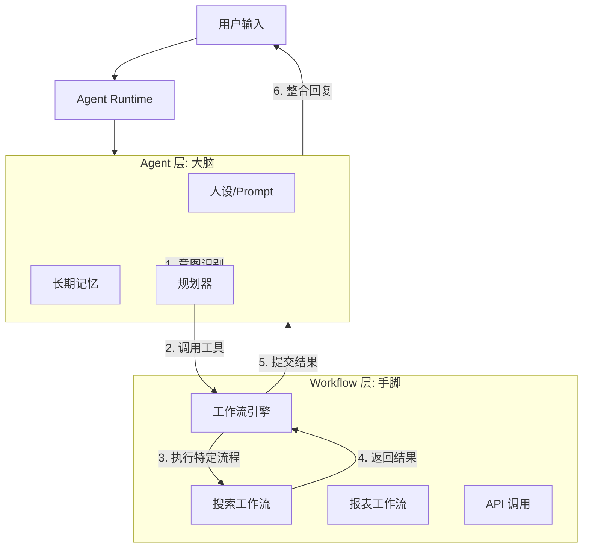

# Agent 执行运行时环境 (Agent Runtime Environment) 架构改造方案

**版本**: 1.0  
**日期**: 2026-02-12  
**状态**: 规划中  
**作者**: Full Stack Engineer  

---

## 1. 触发识别机制 (Triggering & Recognition)

为了在用户对话中明确识别并触发正确的工作流，我们将构建一个 **三层路由调度器 (Triple-Layer Dispatcher)**。

### 1.1 三层路由架构

1.  **L1: 确定性指令层 (Deterministic Layer)**
    *   **机制**: 精确匹配（Prefix Match / Regex）。
    *   **用途**: 处理系统指令（如 `/reset`）、明确唤起词（如 `#订票`）。
    *   **优先级**: 最高。如果命中，直接执行。
    *   **用户感知**: 用户显式输入指令，系统立即响应。

2.  **L2: 语义意图层 (Semantic Intent Layer)**
    *   **机制**: 基于 LLM 或向量相似度的意图分类器。
    *   **流程**: `Query` -> `Embedding` -> `Intent Classifier` -> `Workflow ID`。
    *   **阈值控制**: 仅当置信度 > 0.85 时触发，避免误触发。
    *   **用户感知**: 系统回复“正在为您[执行某事]...”，并显示工作流加载状态。

3.  **L3: 默认对话层 (Fallback Chat Layer)**
    *   **机制**: 标准 RAG + LLM 对话。
    *   **用途**: 当无法匹配任何特定工作流时，作为兜底回复。

### 1.2 上下文状态机 (Context State Machine)

系统维护每个会话的 `RuntimeState`，以处理多轮对话中的插槽填充（Slot Filling）。

*   **States**:
    *   `IDLE`: 空闲，监听所有触发器。
    *   `RUNNING_WORKFLOW`: 正在执行工作流，锁定路由。
    *   `AWAITING_INPUT`: 工作流暂停，等待用户输入特定参数。

**路由逻辑伪代码**:
```typescript
async function dispatch(message, state) {
  // 1. 如果处于 Workflow 挂起状态，优先路由给 Workflow 实例
  if (state.status === 'AWAITING_INPUT') {
    return resumeWorkflow(state.instanceId, message);
  }

  // 2. L1: 指令匹配
  if (isCommand(message)) return executeCommand(message);

  // 3. L2: 意图识别
  const intent = await classifyIntent(message);
  if (intent.score > 0.85) {
    return startWorkflow(intent.workflowId, message);
  }

  // 4. L3: 默认对话
  return defaultChat(message);
}
```

---

## 2. Agent 与 Workflow 的架构边界 (Architecture Boundary)

**核心定义**: **Agent 是决策者 (Caller)，Workflow 是执行工具 (Tool)。**

### 2.1 概念对比

| 维度 | Agent (智能体) | Workflow (工作流) |
| :--- | :--- | :--- |
| **本质** | **有状态的实体 (Stateful Entity)** | **无状态的过程定义 (Stateless Definition)** |
| **核心能力** | 记忆 (Memory)、人设 (Persona)、规划 (Planning) | 逻辑编排 (Logic)、API 调用、确定性任务 |
| **生命周期** | 长期存在，随对话演进 | 短暂存在，任务结束即销毁 |
| **数据流向** | 维护 Long-term Memory | 维护 Execution Context |

### 2.2 架构关系图



### 2.3 数据传递机制
*   **Inbound (Agent -> Workflow)**: 通过 `Context Injection` 传递。
    *   `inputs`: 用户当前的 Query。
    *   `agent_profile`: Agent 的人设摘要（动态注入，见下文）。
    *   `conversation_summary`: 对话历史摘要。
*   **Outbound (Workflow -> Agent)**:
    *   `result`: 结构化执行结果（JSON）。
    *   `trace`: 执行过程日志（用于调试）。

---

## 3. 角色绑定副作用分析与优化 (Role Binding Analysis)

### 3.1 核心副作用：人格分裂 (Persona Schizophrenia)
在旧架构中，LLM 节点允许绑定特定角色。
*   **场景**: 用户与“海盗”Agent 对话 -> 触发“请假”Workflow (绑定了“HR”角色)。
*   **后果**: 对话风格突变（海盗 -> HR -> 海盗）。
*   **维护困难**: 通用工作流（如“翻译”）如果绑定了角色，就无法被其他 Agent 复用。

### 3.2 优化建议：动态上下文注入 (Dynamic Context Injection)
**原则**: Workflow 不应拥有“人格”，它只拥有“任务指令”。

1.  **移除硬绑定**: 物理删除 LLM 节点中的 `roleId` 字段（已完成）。
2.  **运行时注入**:
    *   在 Workflow 执行时，将当前 Agent 的 System Prompt 作为变量 `agent_system_prompt` 注入到上下文。
    *   LLM 节点逻辑：优先使用节点自身的 Task Prompt，如果需要保持人设，则引用 `{{agent_system_prompt}}`。

**重构后的节点配置示例**:
*   *Task Prompt*: "你是一个翻译工具。请翻译以下内容：{{input}}" (完全忽略 Agent 人设)
*   *Chat Prompt*: "{{agent_system_prompt}}。基于以上设定，回答用户关于 {{input}} 的问题。" (继承 Agent 人设)

---

## 4. 实施计划 (Implementation Plan)

### 4.1 技术栈选型
*   **Runtime Core**: NestJS (现有) + RxJS (事件流处理)。
*   **Workflow Engine**: Node.js Native (轻量级) 或 Temporal (如果需要长时运行)。当前阶段维持 Node.js Native。
*   **Queue**: BullMQ (Redis) 用于异步任务调度。
*   **Vector DB**: LanceDB (现有) 用于意图匹配。

### 4.2 核心模块设计

#### A. 对话管理 (Conversation Manager)
*   **职责**: 维护 `ConversationState`，处理 SSE 流式响应。
*   **接口**: `POST /chat/completions` (兼容 OpenAI 格式)。

#### B. 意图识别器 (Intent Recognizer)
*   **职责**: 将 Query 映射到 Workflow ID。
*   **实现**:
    1.  加载所有可用 Workflow 的 `description` 和 `keywords`。
    2.  生成 Embedding 并存入 LanceDB。
    3.  运行时进行 Vector Search (Top-1)。

#### C. Agent 调度器 (Agent Dispatcher)
*   **职责**: 协调 Agent 与 Workflow 的交互。
*   **逻辑**:
    *   `Dispatcher.dispatch(message)` -> `Router.route()` -> `WorkflowEngine.execute()`.

### 4.3 测试验证方案
1.  **意图识别准确率测试**:
    *   构建包含 50+ 条 Query 的测试集（覆盖不同 Intent）。
    *   自动化运行测试，计算准确率 (Accuracy) > 90% 为合格。
2.  **上下文一致性测试**:
    *   测试 Agent 在调用 Workflow 前后的回复风格是否保持一致。
3.  **压力测试**:
    *   并发执行 20+ 个复杂工作流，监控内存与延迟。

### 4.4 监控告警
*   **关键指标 (Metrics)**:
    *   `intent_match_rate`: 意图匹配成功率。
    *   `workflow_execution_time`: 工作流耗时。
    *   `llm_token_usage`: Token 消耗量。
*   **日志 (Logging)**:
    *   保留完整的 `Trace ID` 链路：Request -> Intent -> Workflow -> Node -> Response。

---

## 5. 总结

本方案通过**解耦 Agent 与 Workflow**，确立了“Agent 为脑，Workflow 为手”的架构原则。通过引入**三层路由机制**和**动态上下文注入**，解决了触发识别不清和角色人格分裂的问题，为构建生产级的 Agent 运行时环境奠定了坚实基础。
