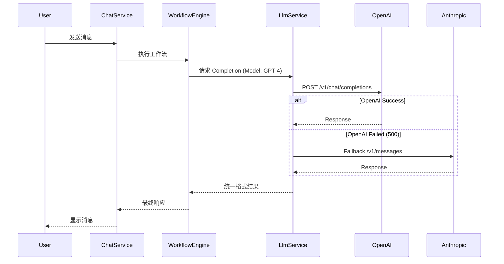

# 对话模型接入详细设计文档

## 1. 架构概览

对话模型接入层 (`LlmService`) 负责屏蔽底层 Provider (OpenAI, Anthropic, Local LLM) 的差异，提供统一的 Chat Completion 和 Embedding 接口。

### 核心能力
- **统一接口**: `chatCompletion(messages, options)`, `chatStream(messages, options)`
- **多模态支持**: 预留 Vision 支持 (目前仅 Text)
- **高可用**: 超时控制、自动重试、Provider 降级

## 2. 接口定义

### 输入 (ChatOptions)
```typescript
interface ChatOptions {
  model: string;          // 模型标识 (e.g., 'gpt-4')
  temperature?: number;   // 随机性 (0-1)
  maxTokens?: number;     // 最大输出 Token
  stream?: boolean;       // 是否流式
  timeout?: number;       // 超时时间 (ms)
  retry?: number;         // 重试次数
}
```

### 输出
- **非流式**: `Promise<string>`
- **流式**: `AsyncIterable<UnifiedChunk>`

## 3. 异常处理流程

1. **请求发起**:
   - 检查 Rate Limit
   - 计算预估 Token (可选)

2. **调用 Provider**:
   - 捕获网络错误 (ECONNRESET, ETIMEDOUT) -> **立即重试**
   - 捕获 429 (Rate Limit) -> **指数退避重试**
   - 捕获 5xx (Server Error) -> **尝试降级 Provider** (e.g., OpenAI -> Anthropic)

3. **结果处理**:
   - 验证输出完整性
   - 记录 Token Usage (用于计费/统计)

## 4. 接入时序图 (Conceptual)


