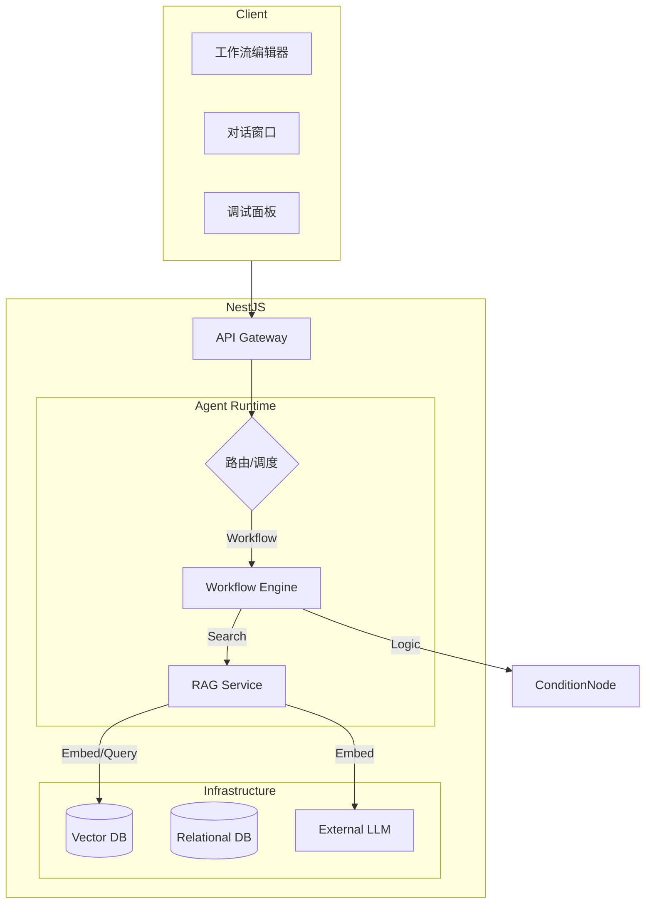

# 系统升级规划文档 V3.0

## 1. 升级愿景
打造 **工业级** 的 Coze 还原平台，从“原型验证”迈向“生产可用”。核心聚焦于 **数据的真实性**（Real RAG）、**逻辑的复杂性**（Advanced Workflow）以及 **交付的标准化**（DevOps & Docs）。

## 2. 核心迭代路径

### 2.1 RAG 引擎真实化 (Real RAG Engine)
**现状**: V2.0 使用 Mock 数据，无法真正检索文档。
**目标**: 集成嵌入式向量数据库，实现“上传即检索”。
- **技术选型**: 
  - 向量库: `LanceDB` (Node.js 嵌入式，无需 Docker，轻量高效)。
  - Embedding: 复用 `LlmService` (对接 OpenAI/Ollama 接口)。
  - 解析器: `pdf-parse` (PDF), `mammoth` (Word), `text` (Markdown/TXT)。
- **功能点**:
  - 文档上传 API：接收文件流 -> 解析文本 -> 分块 (Chunking)。
  - 向量化与存储：调用 Embedding -> 存入 LanceDB Table。
  - 混合检索：支持基于语义的 Top-K 检索。

### 2.2 工作流逻辑增强 (Advanced Workflow)
**现状**: V2.0 仅支持线性/简单分支，缺乏逻辑判断能力。
**目标**: 支持复杂的业务逻辑编排。
- **新增节点**:
  - **条件节点 (Condition)**: 支持 `If-Else` 逻辑 (e.g., `{{input}} contains 'error'`).
  - **HTTP 请求节点 (Request)**: 支持调用外部 API (GET/POST)，解析 JSON 响应。
- **编辑器增强**:
  - 动态连线校验：防止环路或类型不匹配。
  - 节点状态可视化：执行时高亮当前节点（需配合流式输出）。

### 2.3 体验与工程化 (UX & Engineering)
- **调试模式 (Debug Mode)**: 在编辑器中直接运行，右侧面板显示每个节点的 Input/Output/Status。
- **流式响应 (Streaming)**: 工作流执行过程通过 SSE 实时推送到前端，不再只有最终结果。
- **文档体系**: 输出《系统说明文档 3.0》，包含完整的 API 定义与架构视图。

## 3. 架构设计 (V3.0)

## 4. 实施计划
1.  **Phase 1**: 引入 `vectordb` (LanceDB)，改造 `RagService`。
2.  **Phase 2**: 升级 `WorkflowEngine`，支持 Condition 节点解析与执行。
3.  **Phase 3**: 更新前端编辑器，支持新节点配置。
4.  **Phase 4**: 编写最终系统文档。
