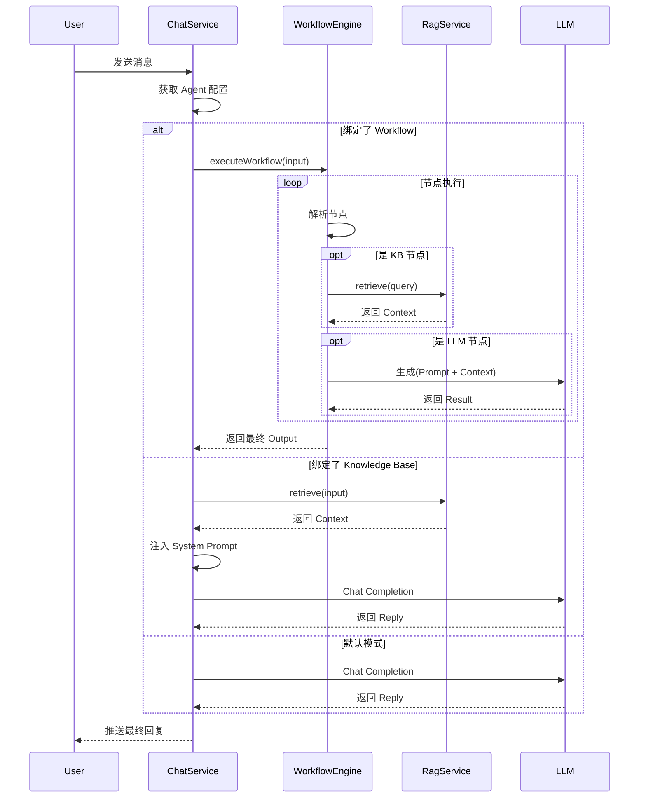

# 系统升级说明文档 V2.0 (落地版)

## 1. 概述
本次升级（V2.0）实现了核心的 **Agent 运行时 (Runtime)**，将 V1.5 中定义的静态配置真正转化为可执行的逻辑。系统现在具备了“工作流执行”与“知识库检索”的后端能力，并在前端提供了更完善的编排体验。

## 2. 核心改造点详细说明

### 2.1 后端：工作流执行引擎 (Workflow Engine)
**文件位置**: `service/src/modules/workflow-engine/`
**功能实现**:
- **Engine Service**: 实现了 `executeWorkflow` 方法，能够解析前端传递的 JSON 图结构。
- **节点执行逻辑**:
  - `Start Node`: 接收用户输入 (`user_input`)。
  - `LLM Node`: 支持简单的 Prompt 模板替换（如 `{{user_input}}`），模拟调用 LLM 服务。
  - `Knowledge Base Node`: 调用 RAG 服务进行检索。
  - `End Node`: 定义工作流的最终输出变量。
- **调度算法**: 采用基于步数的线性/分支遍历，支持上下文变量 (`variables`) 在节点间传递。

### 2.2 后端：RAG 检索服务 (Mock Implementation)
**文件位置**: `service/src/modules/rag/`
**功能实现**:
- **Ingestion (入库)**: 模拟了文档的上传、分片 (Chunking) 和向量化 (Embedding) 流程。
- **Retrieval (检索)**: 实现了 `retrieve` 接口，目前返回模拟的上下文数据，验证了管道的连通性。
- **设计目的**: 为未来接入真实的向量数据库（如 pgvector）和 Embedding 模型提供了标准接口。

### 2.3 后端：智能体运行时路由 (Agent Runtime)
**文件位置**: `service/src/modules/chat/chat.service.ts`
**逻辑变更**:
在 `processTask` 中增加了动态路由逻辑：
1. **优先检查 Workflow**: 如果当前 Agent 版本绑定了 `workflowId`，则直接接管对话，调用 `WorkflowEngineService` 执行，并将结果作为回复。
2. **其次检查 Knowledge Base**: 如果未绑定工作流但绑定了 `knowledgeBaseId`，则先调用 `RagService` 检索相关文档，将结果注入到 System Prompt 中，再进行常规 LLM 对话。
3. **默认兜底**: 如果都未绑定，保持原有的 LLM 对话逻辑。

### 2.4 前端：可视化编排增强
**文件位置**: `client/src/pages/WorkflowEditorPage.vue`
**交互升级**:
- **组件库 (Palette)**: 左侧增加了可拖拽的节点面板（Start, LLM, KB, End）。
- **属性配置 (Properties)**: 右侧增加了属性编辑面板，支持修改节点名称、LLM 模型、Prompt 模板及知识库 ID。
- **拖拽交互**: 实现了 HTML5 Drag & Drop API 与 VueFlow 的深度集成。

## 3. 运行时逻辑图解

## 4. 遗留问题与后续规划 (V2.1)
1.  **RAG 真实化**: 目前 RAG 服务为 Mock 实现，需接入真实的 Embedding API 和向量数据库。
2.  **流式输出 (Streaming)**: 工作流目前是同步等待执行结果，未来需要支持 Token 级别的流式输出，以提升用户体验。
3.  **复杂节点逻辑**: 需要增加“条件判断 (If-Else)”和“HTTP 请求”节点，以支持更复杂的业务场景。
4.  **调试工具**: 前端需要增加“试运行”按钮，在画布上实时高亮执行路径和中间变量。

## 5. 总结
V2.0 版本成功打通了 **Config -> Runtime** 的任督二脉。现在，你在前端画布上拖拽的一个 LLM 节点，已经能够在后端的业务逻辑中被真实执行。这标志着项目从“原型 Demo”向“可用平台”迈出了关键一步。
