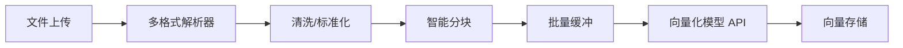

# 文档向量化技术架构方案 (Technical Architecture)

## 1. 架构设计 (Architecture Design)

采用 **Pipeline** 模式处理文档上传与索引：



### 核心模块
1.  **DocumentParser**: 策略模式，根据 MIME Type 选择解析器。
    *   `application/pdf` -> `pdf-parse`
    *   `application/vnd.openxmlformats-officedocument.wordprocessingml.document` -> `mammoth`
    *   `text/plain`, `text/markdown` -> 直接读取
2.  **TextCleaner**: 正则表达式处理。
    *   去除多余空行/空格
    *   去除不可见字符
3.  **TextSplitter**: 递归字符切分 (Recursive Character Splitter)。
    *   优先分隔符: `\n\n`, `\n`, `. `, `? `, `! `
    *   Overlap: 50-100 chars (保持上下文连续性)

## 2. 模型选择 (Model Selection)

### 决策：继续使用 External LLM API (OpenAI/Anthropic)

*   **理由**:
    1.  **一致性**: 项目已有 `LlmService`，复用现有 API Key 和配置。
    2.  **轻量级**: Node.js 服务端不适合运行沉重的 PyTorch/Transformer 模型（避免 Python 依赖地狱）。
    3.  **质量**: OpenAI `text-embedding-3-small` 或同类模型在多语言通用性上表现优异。
    4.  **成本**: 向量化 API 价格极低，且当前阶段数据量可控。

*   **未来扩展**: 若需私有化部署，可单独部署 Python Embedding Service，通过 HTTP 接口调用，保持 Node.js 层架构不变。

## 3. 技术规范 (Technical Specs)

*   **向量维度**: 1536 (OpenAI Standard)
*   **Chunk Size**: 500-1000 tokens (适配 RAG 检索粒度)
*   **Chunk Overlap**: 100 tokens
*   **索引结构 (LanceDB)**:
    ```typescript
    interface ChunkRecord {
      id: string;          // UUID
      vector: number[];    // Float32Array[1536]
      content: string;     // 文本内容
      documentId: string;  // 关联文档 ID
      metadata: string;    // JSON String: { page: 1, source: "file.pdf" }
    }
    ```

## 4. 开发环境与依赖

*   **Runtime**: Node.js v18+
*   **Libraries**:
    *   `pdf-parse`: PDF 解析
    *   `mammoth`: Word 解析
    *   `gpt-tokenizer` (可选): 更精确的 token 计算
