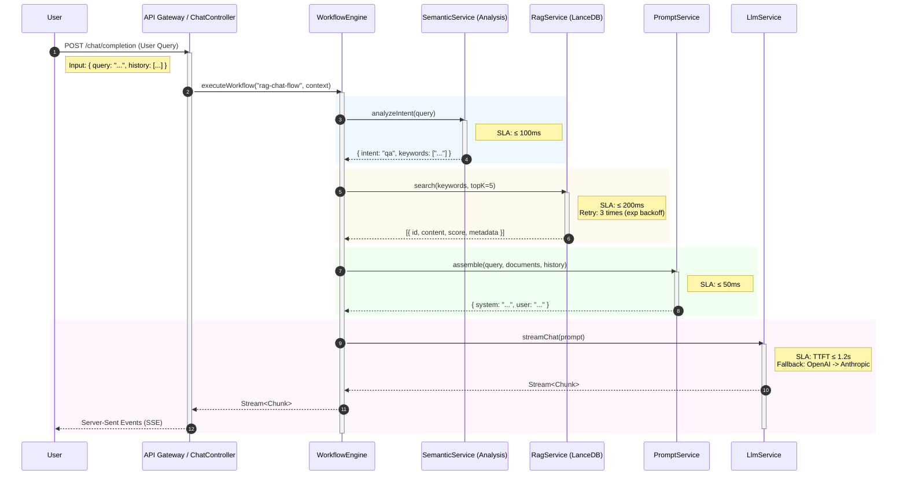

# 核心工作流整合设计

## 1. 核心时序图：RAG 对话流程

本流程描述了从用户提问到最终答案返回的完整链路。

**SLA 目标**:
- 端到端首包延迟 (TTFT): ≤ 1.5s
- 向量检索延迟: ≤ 200ms
- 总生成时间: 取决于输出长度，吞吐量 ≥ 20 tokens/s



## 2. 步骤详细定义

### 2.1 语义理解 (Semantic Understanding)
*   **输入 (Input)**
    ```json
    {
      "query": "如何在 Windows 上安装 Docker？",
      "history": [
        { "role": "user", "content": "..." },
        { "role": "assistant", "content": "..." }
      ]
    }
    ```
*   **输出 (Output)**
    ```json
    {
      "intent": "technical_support",
      "rewritten_query": "Windows Docker 安装教程",
      "keywords": ["Windows", "Docker", "Install"],
      "requires_search": true
    }
    ```
*   **异常处理**:
    *   `SEMANTIC_TIMEOUT` (Code: 4001): 默认降级为直接使用原始 Query，`requires_search=true`。

### 2.2 向量检索 (Vector Retrieval)
*   **输入 (Input)**
    ```json
    {
      "query_text": "Windows Docker 安装教程",
      "top_k": 5,
      "threshold": 0.75,
      "collection": "knowledge_base_v1"
    }
    ```
*   **输出 (Output)**
    ```json
    {
      "documents": [
        {
          "id": "doc-123",
          "content": "Docker Desktop for Windows requires Hyper-V...",
          "score": 0.89,
          "metadata": { "source": "install_guide.md" }
        }
      ]
    }
    ```
*   **异常处理**:
    *   `VECTOR_DB_CONN_ERR` (Code: 5001): 重试 3 次（间隔 100ms, 200ms, 400ms）。
    *   `NO_DOCS_FOUND`: 返回空列表，流程继续（退化为纯 LLM 聊天）。

### 2.3 Prompt 组装 (Prompt Assembly)
*   **输入 (Input)**
    ```json
    {
      "original_query": "如何在 Windows 上安装 Docker？",
      "retrieved_docs": [...],
      "template_id": "rag_qa_v1"
    }
    ```
*   **输出 (Output)**
    ```json
    {
      "messages": [
        { "role": "system", "content": "You are a helpful assistant. Use the following context..." },
        { "role": "user", "content": "Context:\n...\n\nQuestion: 如何在 Windows 上安装 Docker？" }
      ]
    }
    ```
*   **异常处理**:
    *   `TEMPLATE_RENDER_ERR` (Code: 4002): 使用默认通用模板。

### 2.4 对话模型 (LLM Chat)
*   **输入 (Input)**
    ```json
    {
      "messages": [...],
      "model": "gpt-4-turbo",
      "temperature": 0.3,
      "stream": true
    }
    ```
*   **输出 (Output)**
    *   Stream of Chunks: `{"content": "First", "finish_reason": null}`
*   **异常处理**:
    *   `LLM_PROVIDER_TIMEOUT` (Code: 5002): 切换 Provider (e.g., Azure OpenAI -> Anthropic Claude)。
    *   `CONTEXT_LENGTH_EXCEEDED` (Code: 4003): 自动裁剪历史消息或检索文档（丢弃分数最低的文档）。

## 3. 错误码汇总

| 错误码 | 描述 | 策略 |
| :--- | :--- | :--- |
| 4001 | 语义分析超时/失败 | 降级：跳过重写，直接检索 |
| 4002 | 模板渲染失败 | 降级：使用 Fallback 模板 |
| 4003 | 上下文超长 | 策略：裁剪 History > 裁剪 Docs |
| 5001 | 向量库连接失败 | 重试：Exp Backoff (3次) -> 降级：纯聊 |
| 5002 | LLM 调用超时 | 故障转移：切换备用模型/供应商 |
| 5003 | LLM 限流 (Rate Limit) | 重试：Exp Backoff (5次) |

