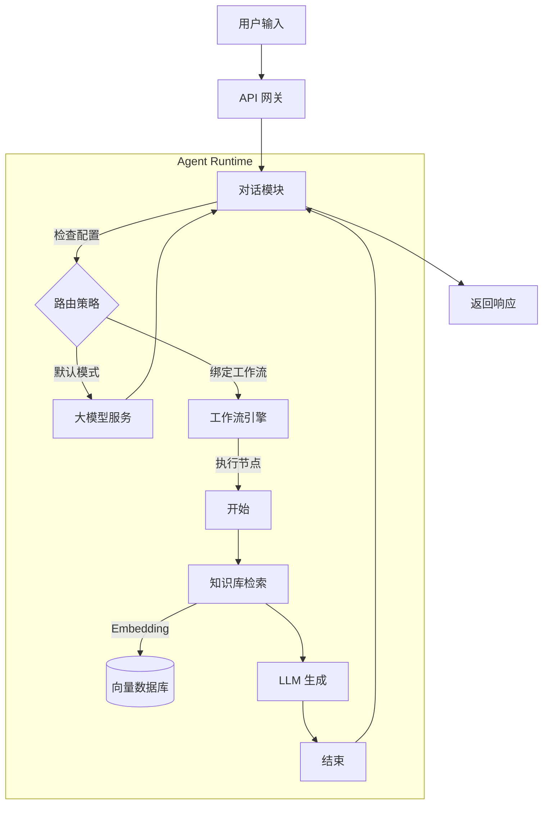

# 系统升级规划文档 V2.0

## 1. 升级目标
构建完整的 Agent 执行运行时环境，实现工作流的后端执行引擎与知识库的向量检索能力，打通 "配置 -> 执行" 的完整闭环。

## 2. 核心改造点详解

### 2.1 工作流执行引擎 (Workflow Engine)
**目标**：让前端编排的 JSON 图数据在后端能够真正运行。
- **步骤 1：节点注册机制**
  - 定义标准节点接口（Input/Output/Execute）。
  - 实现基础节点：开始、结束、LLM 调用、条件分支、HTTP 请求。
- **步骤 2：图解析与调度器**
  - 解析前端传递的 `graphData` (Nodes/Edges)。
  - 实现基于拓扑排序或事件驱动的调度器，管理节点执行顺序。
- **步骤 3：上下文管理**
  - 在节点间传递数据（Variables/State）。
  - 支持从 Chat 模块传入用户输入，并将结果返回给 Chat 模块。

### 2.2 知识库 RAG 全链路 (RAG Pipeline)
**目标**：实现文档的解析、向量化、存储与检索。
- **步骤 1：文档处理服务**
  - 集成文件解析库（如 `pdf-parse`, `mammoth`），支持 PDF/Word/TXT 转文本。
  - 实现分片（Chunking）策略（按字符数、按段落）。
- **步骤 2：向量存储集成**
  - 引入向量数据库（推荐 `pgvector` 或 `Chroma`，开发环境可用 `LanceDB`）。
  - 实现 Embedding 服务接口（对接 OpenAI Embedding 或本地模型）。
- **步骤 3：检索增强生成**
  - 在 Chat 模块中拦截消息，先进行向量检索。
  - 将检索到的上下文（Context）注入到 System Prompt 中。

### 2.3 Agent 运行时集成 (Agent Runtime)
**目标**：将 Agent、Workflow 和 KnowledgeBase 串联起来。
- **步骤 1：动态路由策略**
  - 在 `ChatService` 中判断当前 Agent 是否绑定了 Workflow。
  - 如果绑定 Workflow，则跳过默认 LLM 调用，转而调用 Workflow Engine。
- **步骤 2：混合编排**
  - 支持在 Workflow 中通过节点调用 KnowledgeBase 检索。
  - 支持 Agent 在无 Workflow 模式下直接挂载 KnowledgeBase。

### 2.4 前端交互深度优化
**目标**：提升配置效率与可视化体验。
- **步骤 1：节点配置表单**
  - 点击画布节点侧边弹出配置面板。
  - 动态渲染不同类型节点的配置项（如 LLM 节点的 Model/Prompt 配置）。
- **步骤 2：知识库管理增强**
  - 实现文件拖拽上传与进度条。
  - 增加文档切片预览与手动修正功能。
- **步骤 3：调试模式 (Debug Mode)**
  - 在编辑器中直接运行工作流，查看每个节点的输入输出日志。

## 3. 架构演进示意

